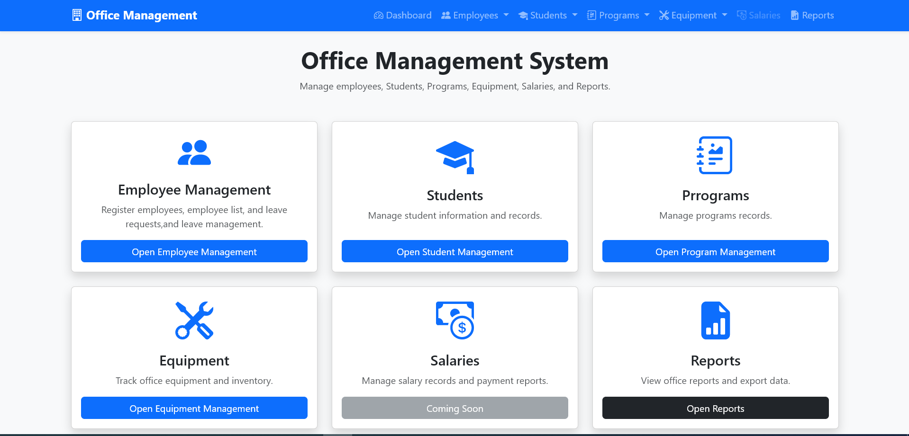
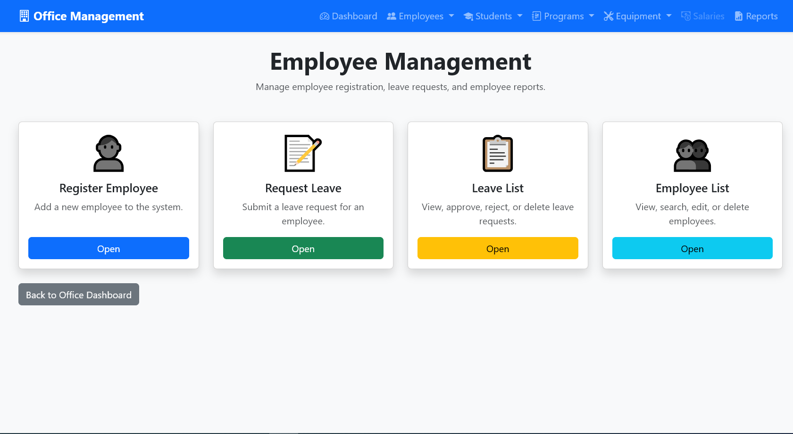
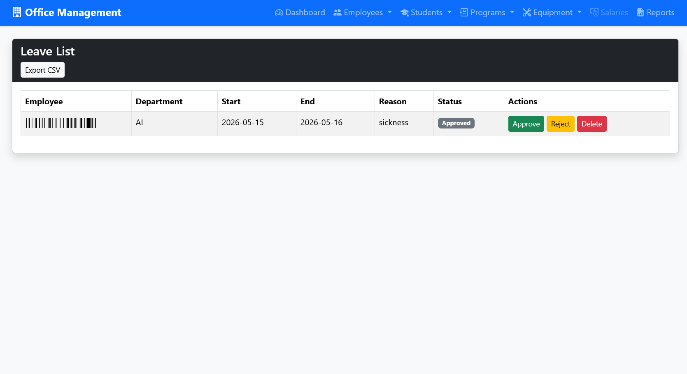
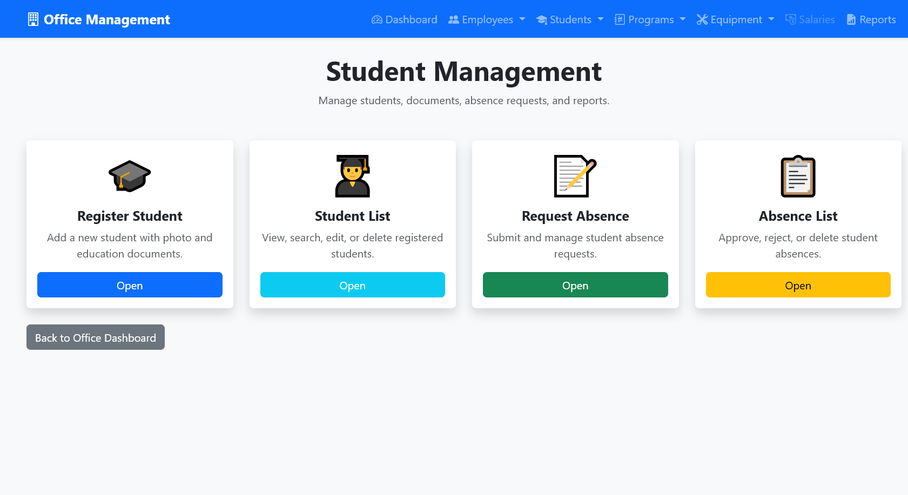
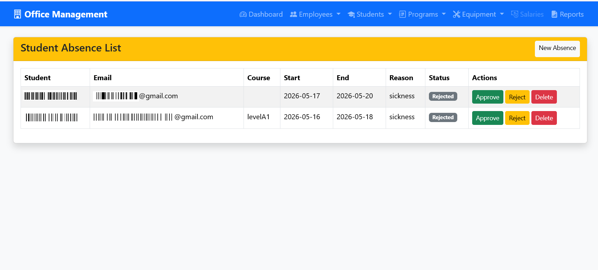

# Office_ERP_Demo
This project is a DEMO of School Management System built using Python, Flask, HTML, CSS, and SQLite. The application was developed to manage school administrative operations including employee management and record organization. The project demonstrates practical experience in backend development, database integration, routing, templates, and full web application structure using Flask.
This project is organized using a simple Flask web application structure. The main application logic is written in `app.py`, while the user interface pages are stored inside the `templates/` folder and styling/assets are stored in the `static/` folder.

### Main Components

- `app.py`  
  Contains the main Flask application, routes, database connection, and backend logic.

- `templates/`  
  Contains HTML pages rendered by Flask, such as dashboard pages, forms, and management pages.

- `static/`  
  Contains CSS, images, JavaScript files, and other frontend assets.

- `requirements.txt`  
  Lists the Python libraries required to run the project.

## Key Capabilities

- Manage school-related records through a web interface
- Add, view, update, and delete information
- Store data using a database
- Render dynamic pages using Flask templates
- Provide a simple and user-friendly admin interface

## Screenshots

### Dashboard
The dashboard is the main entry point of the system. It provides quick access to Employee Management, Student Management, Program Management, Equipment Management, Salaries, and Reports. Each card links to a separate module, making the system easy to navigate.

### Employee Management Page
The Employee Management module allows the office administrator to register employees, manage employee records, submit leave requests, view leave lists, and access employee lists. It keeps employee information organized and supports office HR operations.

#### Leave list
The Leave List page displays employee leave requests with employee name, department, start date, end date, reason, status, and action buttons. The administrator can approve, reject, or delete leave requests. The system also supports CSV export for reporting.

### Student Management Page
The Student Management module is designed to manage student records, student registration, student lists, absence requests, and absence approvals. It also supports uploading student photos and educational documents.

#### Student Absence List
The Student Absence Management module allows administrators to review and manage student absence requests efficiently. Each request includes student information, course details, absence dates, reason, current status, and management actions.
Administrators can approve, reject, or delete absence requests directly from the system. When an absence request is approved or rejected, the system automatically sends an email notification to the corresponding student using SMTP email integration. The email informs the student about the updated status of their request, improving communication between the office administration and students.
This feature helps automate absence management, reduces manual communication, and ensures students receive immediate updates regarding their absence requests.

### Program Management Page
The Program Management module allows administrators to create and manage school programs or courses. It includes options to add a new program and view the program list. Program records can be searched, edited, and deleted through the system.

## Goal

Through this project, I practiced building a complete web application using Python and Flask. I learned how to create routes, connect the application to a database, design templates, organize static files, and structure a project for deployment and GitHub portfolio presentation.
Check the DEMO file to explore more features such as adding, deleting, managing, and generating reports for employees and students. Enjoy!
